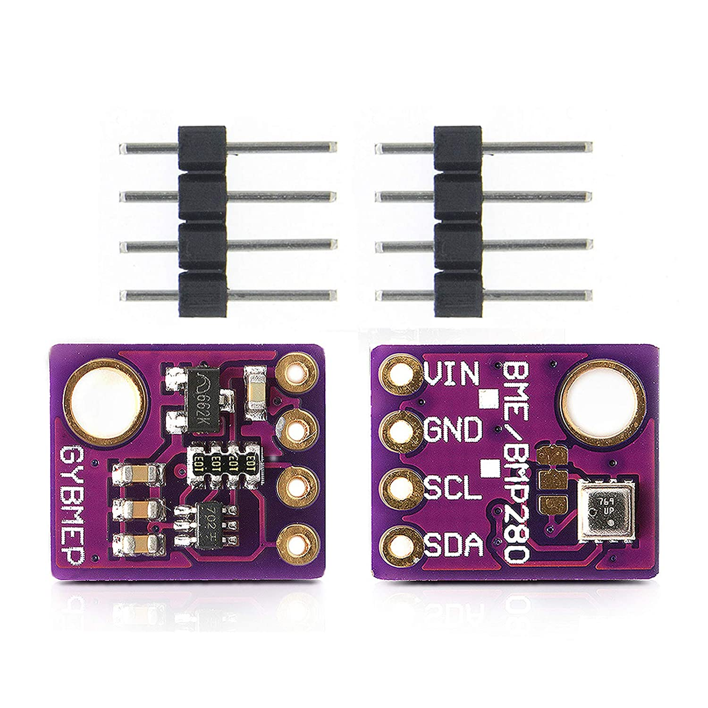
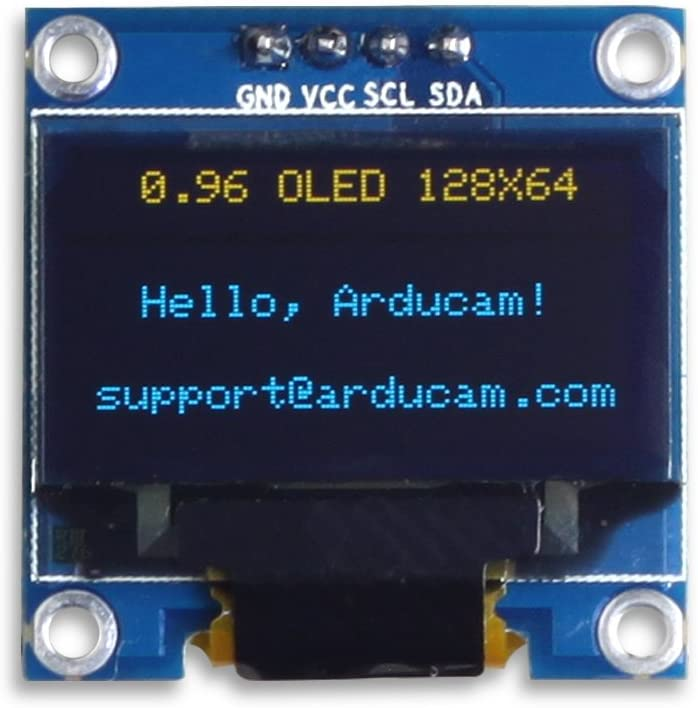

### Steven Fairchild
  - steve51516@gmail.com

# Raspberry Pi PICO Weather Station
### Audience
  
Anyone interested in Programming the Raspberry Pi Pico in Tinygo, more specifically for weather data collection.
  

</img>
  
  - Those interested in Tinygo!
    + https://tinygo.org
    + https://github.com/tinygo-org
    + https://github.com/tinygo-org/tinygo

### Hardware wiring and sensors used
[SparkFun Weather Meter Kit SEN-15901](https://www.sparkfun.com/products/15901) 

  
  - [Assembly Guide](https://learn.sparkfun.com/tutorials/weather-meter-hookup-guide)
  - [Sensors Datasheet](https://cdn.sparkfun.com/assets/d/1/e/0/6/DS-15901-Weather_Meter.pdf)

[Raspberry Pi Pico](https://www.raspberrypi.com/products/raspberry-pi-pico/) 
</img>
  - [Learn More](https://www.raspberrypi.com/documentation/microcontrollers/)

[Bosche BME280](https://www.bosch-sensortec.com/products/environmental-sensors/humidity-sensors-bme280/) 
</img>

#### Hardware planned for future inclusion
[SunFounder RTC PCF8563](https://www.sunfounder.com/products/rtc-nao-sensor) 

[SSD1306 Amazon](https://www.amazon.com/UCTRONICS-SSD1306-Self-Luminous-Display-Raspberry/dp/B072Q2X2LL/ref=sr_1_5?keywords=SSD1306&qid=1656624682&sr=8-5)
[SSD1306 Datasheet](https://cdn-shop.adafruit.com/datasheets/SSD1306.pdf) 

### Usage
#### If you are not using a picoprobe
1. `make release`
1. Plug in Pico
1. `cp build/release /run/media/$USER/RPI-RP2/`
#### With picoprobe
#### To debug and load software via openocd
* build and install openocd from source
  - For Fedora users, run `setup/build_install_openocd.sh`
* Debian/Ubuntu users
  - See the [Getting started with Raspberry Pi Pico](https://datasheets.raspberrypi.com/pico/getting-started-with-pico.pdf) for directions to build and install openocd

### TODO
1. Add anemometer support
  - Requires multicore support to monitor two interrupts at the same time.\
    I'm looking into using the C/C++ SDK's multicore APIs and CGO to use 2nd core\
    See [Tinygo issue 2446](https://github.com/tinygo-org/tinygo/issues/2446)
1. Setup receiver repository to store and transmit data

### Inspiration
  - My desire to learn more about embedded electronics and Go
